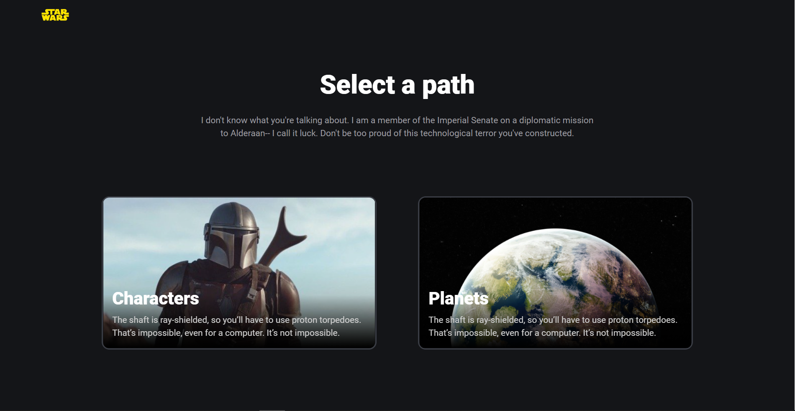

# Star-Wars-Info

Star-Wars-Info an application built to provide valid information about Star-Wars Characters and Planets .

Star-Wars-Info is built with React and its template was bootstrapped using CRA(Create React App). The global State of the Application is handled by Redux and most of the styles are an extension of Bootstrap. Star-Wars-Info allows users to easy navigate information regarding Star-Wars.

&nbsp;

## Built With

- JavaScript, React,Create React App
- Hooks, Redux, Redux thunk,
- Sass, bootstrap.
- SWAPI(Star Wars API).
- Figma

&nbsp;

## Live Demo

[Live Demo Link](https://radio-widget-three.vercel.app/)

&nbsp;

## User Interface Mock up

[Figma Link](https://www.figma.com/file/OEvEm5yotJwoFdaH5hdQvg/Untitled?node-id=4%3A746)

&nbsp;

## Getting Started

To get a local copy up and running follow these simple example steps.

### Prerequisites

To run this project, you will need to have `node`,`npm` or `yarn` already installed locally

### Setup

`cd into the directory with command line terminal`

### Install

run `npm install` or `yarn install` to install all the dependencies of the project

### Usage

run `npm start` or `yarn start` to get the project running

open browser and navigate to `http://localhost:3000/`

## Features

- ✔️ API implementation
- ✔️ A home page showing two categories of items.
- ✔️ A category page (with pagination) to show all of its items.
- ✔️ A details page of one item showing more detailed information.
- ✔️ Search (for one category).
- ✔️ One or two filtering options (for one category).
- ✔️ Web performant.
- ✔️ Accessibility.
- ✔️ Performant.

### Customizations

The styles are written using SASS and SassModules. The local styles for each file can be found in there corresponding `[componentName].module.sass` files in the `src/styles/` directory.

To tweak react components navigate to `src/components` directory.

To theme component global styles navigate to `src/components/useTheme.tsx` directory.

To access global bootstrap styles navigate to `src/styles/main.scss` directory.

&nbsp;

## Deployment

run `npm build` or `yarn build` to generate build folder. You can now serve the build folder on any static server. for more information visit [https://create-react-app.dev/docs/deployment](https://create-react-app.dev/docs/deployment).

&nbsp;

## Authors

👤 **Author**

- Github: [solomonakp](https://github.com/solomonakp)
- twitter: [@dev_chuck](https://twitter.com/dev_chuck)

&nbsp;

&nbsp;

## 📝 License

This project is [MIT](lic.url) licensed.
